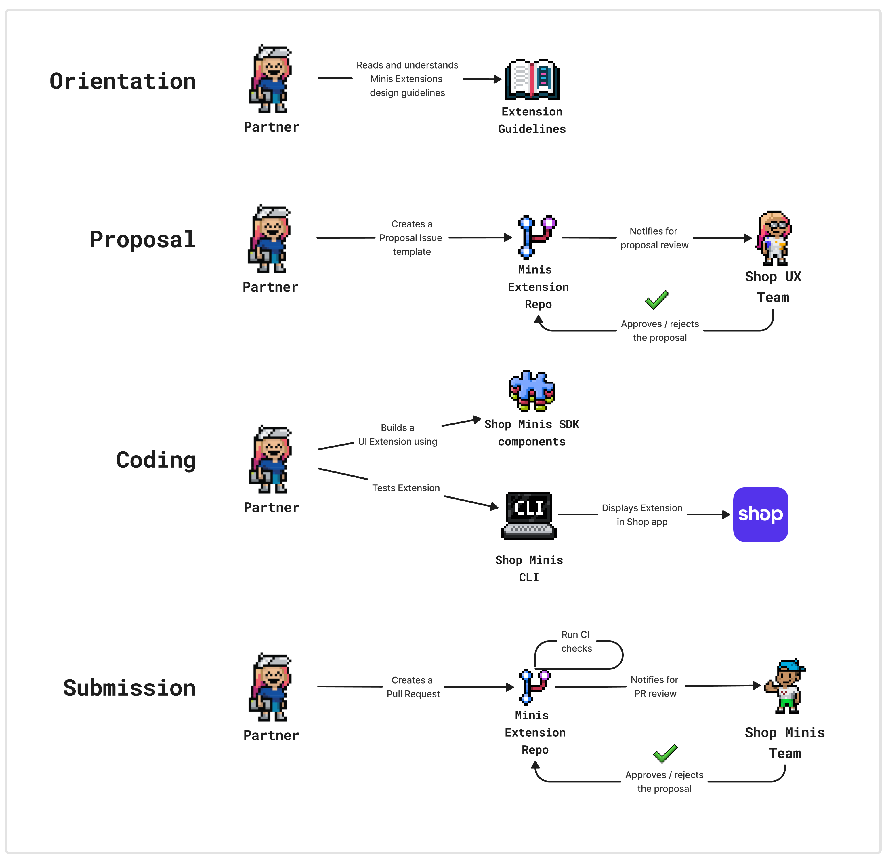

# Contributing to Shop Minis UI Extensions Components

Thank you for your interest in contributing to the Shop Minis UI Extensions Components project! This document outlines the process for contributing to our open-source repository. Please read through this guide to understand how to get started and ensure your contributions align with our standards.

## Contribution Workflow

### 1. Orientation

Before you start contributing, it's essential to familiarize yourself with our design and code guidelines.

- **Read and Understand Guidelines**: Please read the [Minis UI Extensions Components Design Guidelines](DESIGN_GUIDELINES.md), [Code Guidelines](CODE_GUIDELINES.md) and [Code of Conduct](./CODE_OF_CONDUCT.md) to ensure your contributions meet our standards.

### 2. Proposal

Once you are familiar with the guidelines, you can propose a new UI component.

- **Create a Proposal Issue**: Use the [New Component Proposal](../.github/ISSUE_TEMPLATE/new_component_proposal.md) issue template to submit your proposal.
- **Review by UX Team**: Our UX team will review your proposal and provide feedback or approval.
- **Approval/Rejection**: You will be notified if your proposal is approved or if changes are needed.

### 3. Coding

After your proposal is approved, you can start building your UI component.

- **Setup**: Follow the [Code Setup](./CODE_SETUP.md) guide to get your local dev environment running
- **Build the Component**: Use the Shop Minis SDK components to build your UI extension.
- **Test the Extension**: Ensure your extension works correctly by testing it using the Shop Minis CLI and opening the test Mini we provide.

### 4. Submission

Once your component is built and tested, you can submit it for review.

- **Create a Pull Request (PR)**: Submit a PR to this repository with your new component. Use the [PR Template](../.github/PULL_REQUEST_TEMPLATE/pull_request_template.md) to ensure all necessary information is included.
- **Automated Checks**: Our CI/CD system will run automated tests and checks on your PR.
- **Review by Shop Minis Team**: Our team will review your code and provide feedback or approval.
- **Approval/Rejection**: You will be notified if your PR is approved and merged or if changes are needed.

## Contribution Guidelines

### Design Guidelines

- **Visual Consistency**: Ensure components align with the overall look and feel of the Shop app.
- **Responsiveness**: Ensure components work well on different screen sizes and orientations.
- **Performance**: Components should be optimized for performance to ensure smooth user experiences.

### Code Guidelines

- **Code Quality**: Follow best practices for writing clean, maintainable code.
- **Testing**: Include unit tests and, if applicable, integration tests.
- **Documentation**: Provide clear and concise documentation for the component, including usage examples and screenshots or videos in the component's README file.

## Issue Templates

We have several issue templates to help streamline the contribution process:

1. **New Component Proposal**: For proposing new UI components.
2. **Bug Report**: For reporting bugs or issues with existing components.
3. **Feature Request**: For suggesting new features or enhancements to existing components.
4. **General Inquiry**: For asking general questions or seeking clarification on guidelines, processes, or other aspects of the project.

## Pull Request Template

Please use the following [PR Template](../.github/PULL_REQUEST_TEMPLATE/pull_request_template.md) when submitting your pull request to ensure all necessary information is provided.

## Communication and Support

- **Documentation**: Maintain comprehensive documentation to help developers understand how to contribute.
- **Community Engagement**: Use platforms like GitHub Discussions or the `shop-minis` Slack channel in the Shopify Partners community to engage with the community and provide support.
- **Regular Updates**: Keep the community informed about updates, new guidelines, and any changes to the process.

## Continuous Improvement

We are committed to continuously improving our contribution process. Please provide feedback to help us enhance the experience for all contributors.

Thank you for contributing to Shop Minis UI Extensions Components! We look forward to your valuable contributions.

---

*This document is subject to updates. Please check back regularly for any changes.*
