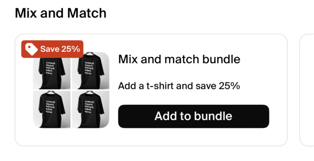
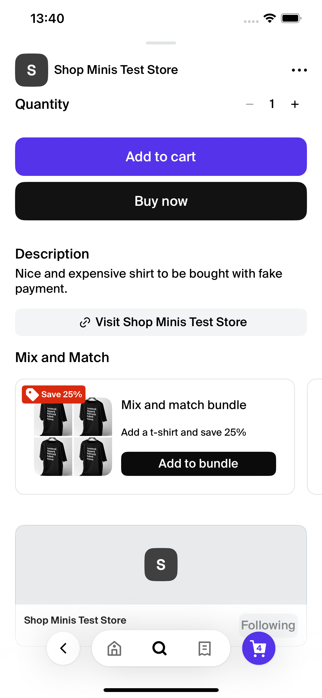

# BundleCollection

The `BundleCollection` component is designed to display a carousel of product bundle cards within a React Native application, utilizing the Shop Minis Platform SDK. Each card in the carousel showcases details such as the bundle's title, subtitle, images, a badge, and an action button. This component is ideal for promoting various product bundles in an engaging and interactive manner.

|  |
|:------------------------------------------------------------------------------:|
| *BundleCollection Example*                                                    |

### Example
```jsx
import { BundleCollection } from '@shopify/shop-minis-ui-extensions'

...

<BundleCollection
  title="Mix and Match"
  bundles={[
    {
      title: "Mix and match bundle",
      subtitle: "Add a t-shirt and save 25%",
      images: [
        "https://example.com/image1.jpg",
        "https://example.com/image2.jpg",
        "https://example.com/image3.jpg",
        "https://example.com/image4.jpg"
      ],
      badgeText: "Save 25%",
      actionButtonText: "Add to bundle",
      actionCallback: () => console.log("Bundle selected")
    }
  ]}
/>
```

### Props
The component accepts the following props structured as `BundleUpsellData`:

- **bundles** (`BundleItem[]`): An array of `BundleItem` objects, each representing a product bundle. Each `BundleItem` includes:
  - **title** (`string`): The title of the bundle.
  - **subtitle** (`string`, optional): A subtitle for additional details.
  - **images** (`string[]`): An array of image URLs for the bundle.
  - **badgeText** (`string`, optional): Text for a badge to highlight special information.
  - **actionButtonText** (`string`): Text for the action button on the card.
  - **actionCallback** (`() => void`): A callback function that is invoked when the action button is pressed.
- **title** (`string`, optional): The title to be displayed above the bundle carousel. Defaults to "Mix and match" if not provided.


|  |
|:----------------------------------------------------------------------------------------:|
| *BundleCollection in ProductPage*                                                         |
