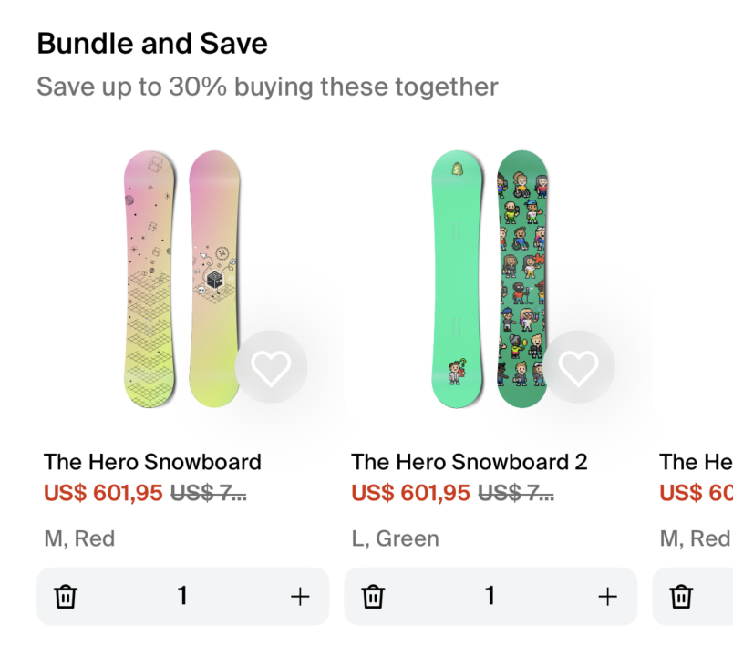
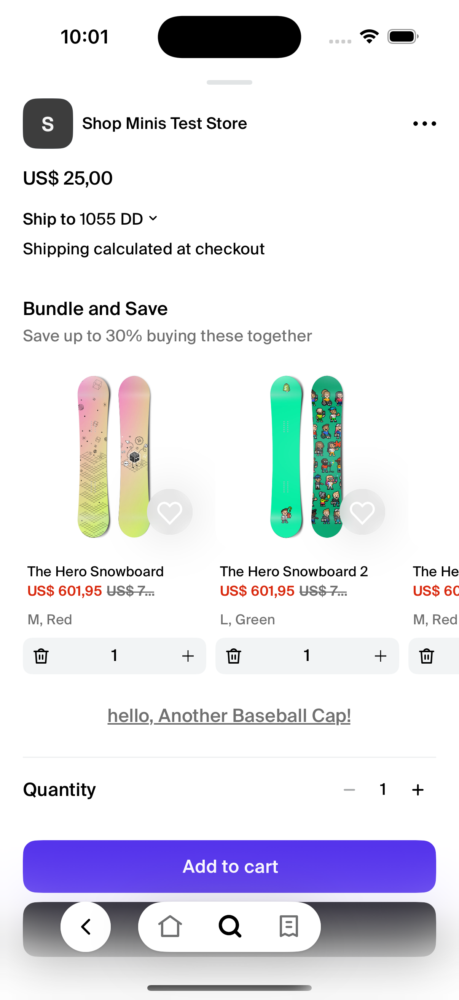

# BundleProductsQuantityCarousel

The `BundleProductsQuantityCarousel` component is designed to display a carousel of product cards within a React Native application, utilizing the Shop Minis Platform SDK. This component is ideal for showcasing products that can be bundled together, allowing users to add or remove products from a bundle directly from the carousel. Each card in the carousel provides interactive elements for adding or removing products.

|  |
|:------------------------------------------------------------------------------:|
| *BundleProductsQuantityCarousel Example*                                                    |

### Example
```jsx
import { BundleProductsQuantityCarousel } from '@shopify/shop-minis-ui-extensions'

...
<BundleProductsQuantityCarousel
  title="Mix and Match"
  subtitle="Add items to your bundle and discover savings"
  products={products}
  shopId="shop456"
  onProductVariantUpdated={(variant, quantity) => {
    console.log(
      'onProductVariantUpdated',
      variant.selectedOptions,
      quantity
    )
  }}
/>
```

### Props
The component accepts the following props:

- **title** (`string`, optional): The title to be displayed above the carousel. Defaults to "Bundle and Save" if not provided. *Note that the title will be forced to fit in a single line and will be truncated with an ellipsis if it exceeds the available width.*
- **subtitle** (`string`, optional): A subtitle to provide additional context or information about the products in the carousel. *Note that the subtitle will be forced to fit in a single line and will be truncated with an ellipsis if it exceeds the available width.*
- **products** (`ProductsCarouselProduct[]`): An array of products to be displayed in the carousel. Each product object includes details necessary for display and interaction.
- **shopId** (`string`): The identifier for the shop where the products are hosted.
- **onProductVariantUpdated** (`(variant: ProductsCarouselProductVariant) => void, quantity?: number `): A callback function that is invoked when variant is selected in the bundle.
- **maxQuantity** (`number`, optional): The maximum quantity for the product variant. If not defined, the quantity will be the defined by the "quantityAvailable" in the variant.


|  |
|:----------------------------------------------------------------------------------------:|
| *BundleProductsCarousel in ProductPage * |
