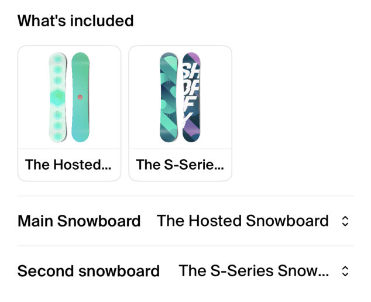
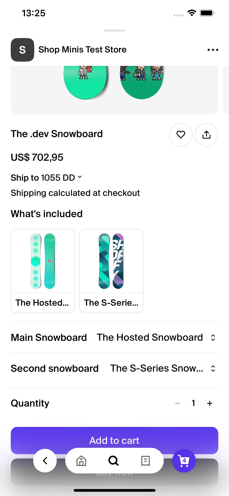

# BundleSelector

The `BundleSelector` component is designed for selecting options for product bundles within a React Native application, utilizing the Shop Minis Platform SDK. It displays a list of items, each with selectable options, and optionally shows a carousel of images if all items have images associated with their selected options. This component is ideal for customizing product bundles.

|  |
|:--------------------------------------------------------------------------:|
| *BundleSelector Example*                                                  |

### Example
```jsx
import { BundleSelector } from '@shopify/shop-minis-ui-extensions'

...

<BundleSelector
  items={[
    {
      title: "What's included",
      options: [
        { title: "The Hosted Snowboard", imageUrl: 'https://example.com/premium.jpg', selected: true },
        { title: "The S-Series Snowboard", imageUrl: "https://example.com/premium.jpg" }
      ]
    }
  ]}
  onChange={updatedItems => setItems(updatedItems)}
  onPressImage={(item, selectedOption) => console.log("Pressed", item, selectedOption)}
/>
```

### Props
The component accepts the following props structured as `BundleSelectorProps`:

- **items** (`BundleSelectorItem[]`): An array of items where each item contains a title, options, and potentially other metadata.
  - **title** (`string`): The title of the item.
  - **options** (`Array<{title: string, imageUrl?: string, selected?: boolean}>`): Options available for the item. Each option can have a title, an optional image URL, and a selection state.
- **onChange** (`(items: BundleSelectorItem[]) => void`): A callback function that is invoked when the selected option for any item changes. This function should update the `items` array in the state of the parent component.
- **onPressImage** (`(item: BundleSelectorItem, selectedOption: {title: string, imageUrl: string}) => void`, optional): A callback function that is invoked when an image in the carousel is pressed. This function receives the pressed item and its selected option.

|  |
|:------------------------------------------------------------------------------------:|
| *BundleSelector in ProductPage*                                                       |
