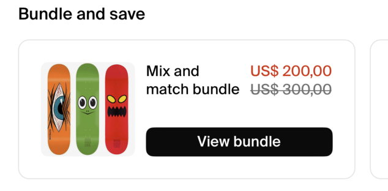
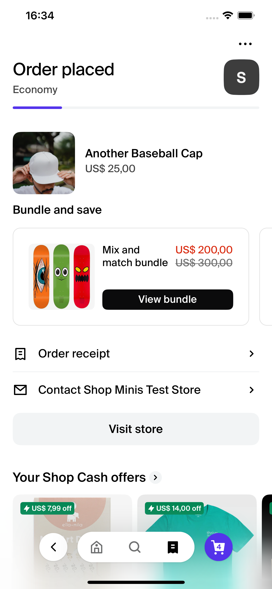

# BundleUpsell

The `BundleUpsell` component is designed to display a horizontal carousel of product bundle cards within a React Native application, utilizing the Shop Minis Platform SDK. This component is ideal for promoting product bundles, allowing users to navigate directly to product details by interacting with the cards. Each card in the carousel showcases a main product and may include additional child products as part of the bundle.

|  |
|:--------------------------------------------------------------------------:|
| *BundleUpsell Example*                                                  |

### Example
```jsx
import { BundleUpsell } from './path/to/BundleUpsell'

...

<BundleUpsell
  title="Bundle and save"
  bundles={bundles}
/>
```

### Props
The component accepts the following props structured as `BundleUpsellData`:

- **bundles** (`BundleItem[]`): An array of `BundleItem` objects, each representing a product bundle. Each `BundleItem` includes:
  - **product** (`Product`): The main product in the bundle.
  - **childProducts** (`Product[]`): An array of additional products included in the bundle.
- **title** (`string`, optional): The title to be displayed above the bundle carousel. Defaults to "Bundle and save" if not provided.

|  |
|:------------------------------------------------------------------------------------:|
| *BundleUpsell in OrderManagementPage* |

