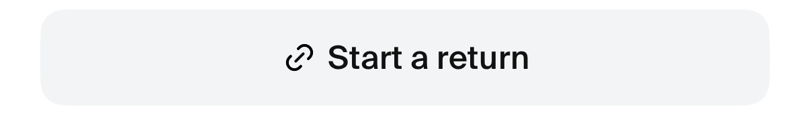
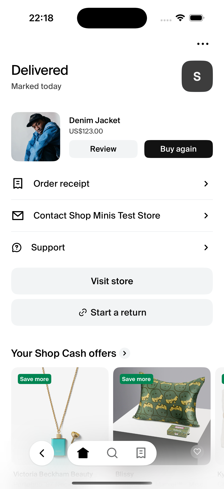

# Button

A standard `Button` from the `shop-minis-platform-sdk`. It comes with some default styling for different targets but accepts all the same props as the SDK Button. If no `onPress` callback is provided, the button will open the Mini Viewer.

|  |
|:--------------------------------------------------------------:|
| *Button*                                     |

### Example
```jsx
import { Button } from '@shopify/shop-minis-ui-extensions'

...

<Button
  text="Start a return"
  leftIcon="link"
  onPress={() => doSomething()}
/>
```

|  |
|:------------------------------------------------------------------------:|
| *Button on the Order Management page*                                          |
