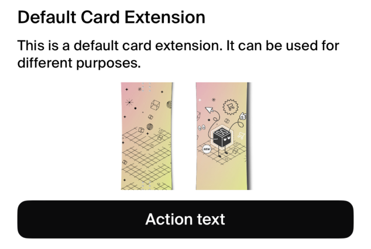
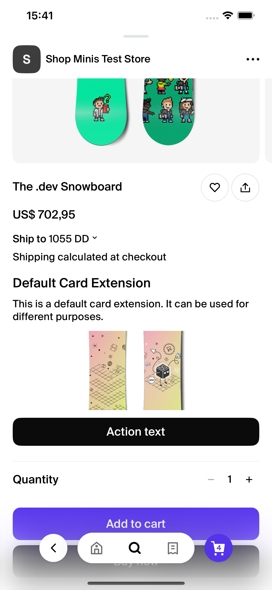

DefaultCard

#### Overview
The `DefaultCard` component is designed to display a card view in a React Native application, utilizing the Shopify Minis Platform SDK. It is used to present a title, text, an image, and an action button that triggers an event when pressed.

#### Props
The component accepts the following props:

- **title** (`string`): The title of the card.
- **text** (`string`): The description or content text displayed on the card.
- **actionText** (`string`): The text displayed on the action button.
- **image** (`Image`): An object representing the image to be displayed on the card. The `Image` type should be defined elsewhere in your project to specify the expected structure (e.g., `{ uri: string }`).

#### Usage
```jsx
<DefaultCard
  title="Sample Title"
  text="Sample text describing the content of the card."
  actionText="Click Me"
  image={{ uri: "path/to/image.jpg" }}
/>
```

#### Dependencies
- **@shopify/shop-minis-platform-sdk/actions**: Used to import `useExtensionShopActions` for handling actions like `openMiniViewer`.
- **@shopify/shop-minis-platform-sdk**: Used to wrap the card component with `ExtensionProviders` which likely provides necessary context or hooks into the Shopify ecosystem.

#### Example
```jsx
<DefaultCard
  title="Default Card Extension"
  text="This is a default card extension. It can be used for different purposes."
  actionText="Action text"
  image={{ uri: "https://example.com/default-card.jpg" }}
/>
```
<div style={{display: 'flex', }}>
<div style={{borderStyle: 'dashed', borderColor: '#6445ED', borderWidth: 2, padding: 8, width: 'fit-content', height: 'fit-content' }}>

</div>
<div>
<br />

</div>
</div>


