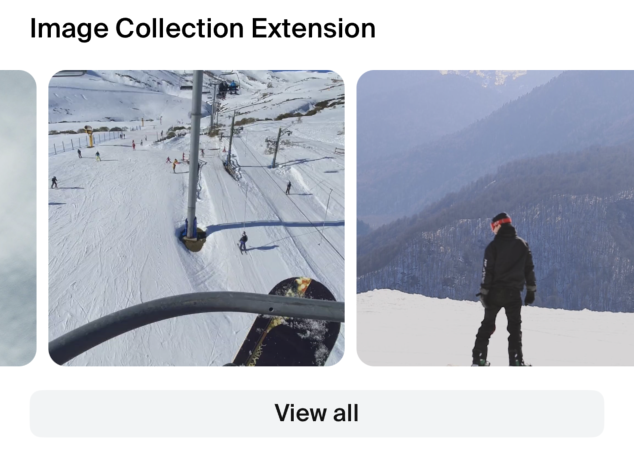

# ImageCollection

The `ImageCollection` component is designed to display a collection of images in either a grid or carousel layout within a React Native application, utilizing the Shop Minis Platform SDK. It is typically used to showcase products related to images sourced from social media platforms like Instagram. The component supports interactive elements, allowing users to view details about the products associated with each image.

#### Props
The component accepts the following props structured as `ImageCollectionData`:

- **items** (`ImageCollectionItem[]`): An array of items where each item contains an image, related products, and other metadata.
  - **image** (`Image`): The image to display.
  - **relatedProducts** (`Array<{product?: Product, productVariantId?: string}>`): Products related to the image.
  - **externalId** (`string`): A unique identifier for external systems.
  - **description** (`string`, optional): A description of the image.
  - **displayDate** (`Date`, optional): The date the image was displayed or posted.
- **title** (`string`, optional): The title of the image collection. Defaults to 'Shop our Instagram' if not provided.
- **layout** (`'GRID' | 'CAROUSEL'`): The layout type for displaying the image collection.

#### Example
```jsx
import { ImageCollection } from '@shopify/shop-minis-ui-extensions'

...

<ImageCollection
  items={[
    {
      image: { uri: "https://example.com/image.jpg" },
      relatedProducts: [
        {
          product: { id: '321', name: 'Awesome Product' },
          productVariantId: '54321'
        }
      ],
      externalId: "002",
      description: "Latest summer collection",
      displayDate: new Date('2023-04-25')
    }
  ]}
  title="Image Collection Extension"
  layout="CAROUSEL"
/>
```

|  |  |
|:----------------------------------------------------------------------------:|:----------------------------------------------------------------------------------:|
| *Image Collection Example*                                                   | *Image Collection Carousel Example*                                                |

|  |  |
|:--------------------------------------------------------------------------------------:|:------------------------------------------------------------------------------------------------:|
| *Product Page Image Collection Example*                                                         | *Product Page Image Collection Carousel Example*                                                          |
