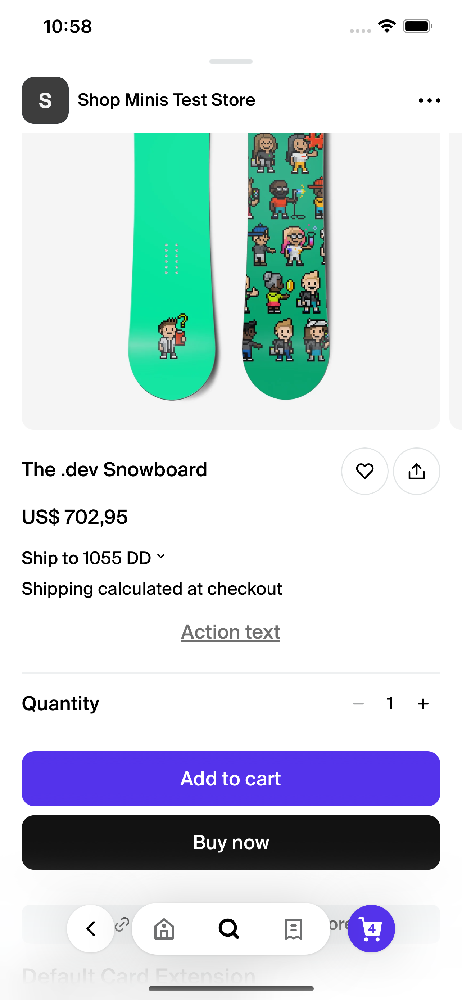

# Link

The `Link` component is designed to function as an interactive link within a React Native application, utilizing the Shop Minis Platform SDK. It displays text that, when pressed, triggers an event defined within the component.

#### Props
The component accepts the following prop:

- **actionText** (`string`): The text displayed on the link. This text is typically actionable and prompts the user to interact.

#### Example
```jsx
import { Link } from '@shopify/shop-minis-ui-extensions'

...

<Link
  actionText="Action text"
/>
```
|  |
|:--------------------------------------------------------------:|
| *Interactive Link Example*                                     |

|  |
|:------------------------------------------------------------------------:|
| *Interactive Link Product Page Example*                                          |
