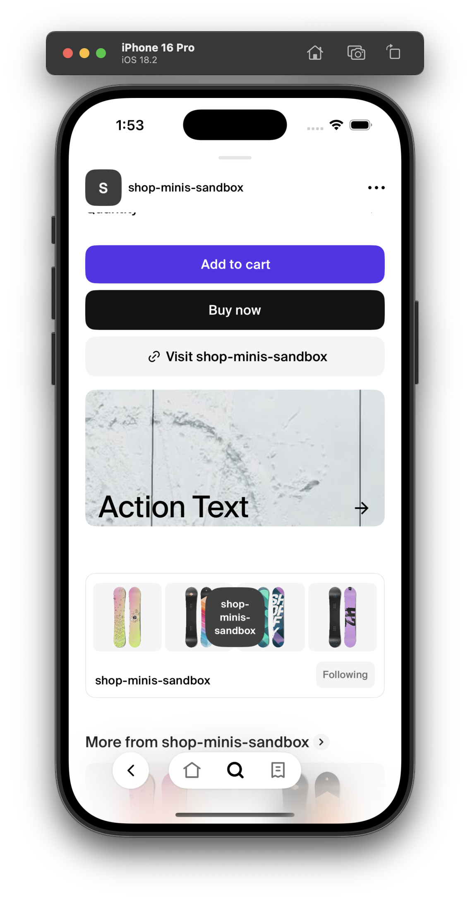

# Marketing Card

The `Marketing Card` component is designed to display a card view in a React Native application, utilizing the Shop Minis Platform SDK. It is used to present action text, and an icon overlayed on top of an image.

|  |
|:-------------------------------------------------------------:|
| *MarketingCard example*                                             |

### Example
```jsx
import {MarketingCard} from '@shopify/shop-minis-ui-extensions'

...

<MarketingCard
  iconName="arrow-right"
  actionText="Action text"
  image={{ uri: "https://example.com/marketing-card.jpg" }}
  aspectRatio={2}
  resizeMode="cover"
/>
```

### Props
The component accepts the following props:

- **iconName** (`string`): The icon displayed on the right side of the text (can only use icons that are included with the @shopify/shop-minis-platform-sdk)
- **actionText** (`string`): The text displayed on the action button.
- **image** (`Image`): An object representing the image to be displayed on the card. The `Image` type should be defined elsewhere in your project to specify the expected structure (e.g., `{ uri: string }`).
- **aspectRatio** (`number`): The aspect ratio of the image background.
- **resizeMode** (`'contain' | 'cover' | 'stretch' | 'center'`): The resize mode of the image background.

|  |
|:------------------------------------------------------------------:|
| *MarketingCard in ProductPage*                                                  |
