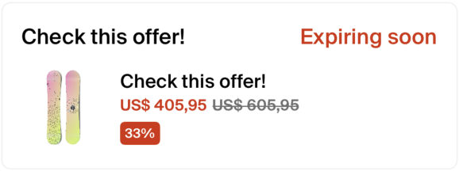
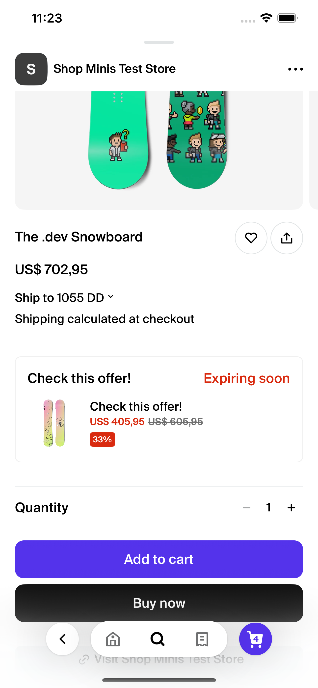

# ProductOfferCard

The `ProductOfferCard` component is designed to display a promotional or discount offer related to a product within a React Native application, utilizing the Shop Minis Platform SDK. It showcases product details such as the discounted price, original price, and an optional expiry date, along with an image of the product.

#### Props
The component accepts the following props structured as `ProductOfferCardData`:

- **product** (`Product`): Information about the product. This object should conform to the `Product` type defined in your project.
- **order** (`Order`): Details about the order associated with the product. This object should conform to the `Order` type.
- **offer** (`object`): Details about the offer including:
  - **discountedPrice** (`Price`): The discounted price of the product.
  - **originalPrice** (`Price`): The original price of the product.
  - **variantId** (`string`, optional): The variant ID of the product, if applicable.
  - **title** (`string`, optional): The title of the offer.
  - **expiresAt** (`Date`, optional): The expiration date of the offer.
  - **image** (`Image`): An image representing the product or offer.


#### Example
```jsx
import { ProductOfferCard } from '@shopify/shop-minis-ui-extensions'

...

<ProductOfferCard
  product={{ id: '123', name: 'Awesome Product' }}
  order={{ id: '456', status: 'pending' }}
  offer={{
    discountedPrice: { amount: '15.00', currencyCode: 'USD' },
    originalPrice: { amount: '20.00', currencyCode: 'USD' },
    image: { uri: "https://example.com/product.jpg" },
    title: "Limited Time Offer",
    expiresAt: new Date('2023-12-31')
  }}
/>
```
|  |
|:-------------------------------------------------------------------------------:|
| *ProductOfferCard Example*                                                    |

|  |
|:----------------------------------------------------------------------------------------:|
| *Product Page ProductOfferCard Example*                                                        |
