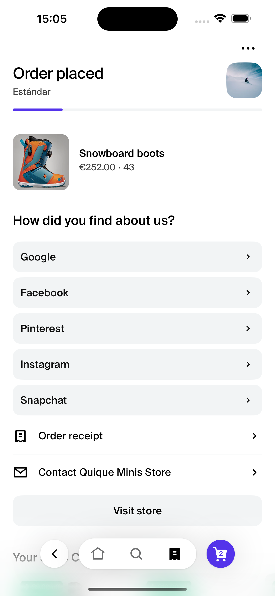
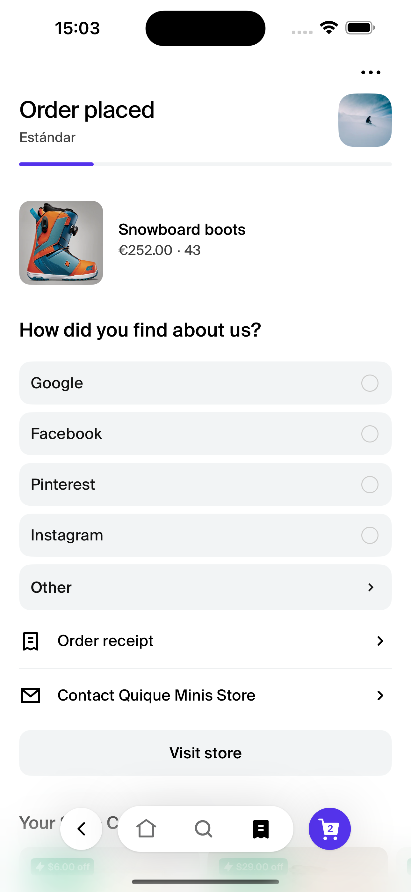

# SurveySingleResponse

The `SurveySingleResponse` component is a versatile survey tool designed for Shop and meant to be used in the Shop Minis Platform. It presents users with a single-choice survey question, allowing them to select one option from a list of choices.

|                         Single-Question Survey                          |                          Multiple-Question Survey                           |
| :---------------------------------------------------------------------: | :-------------------------------------------------------------------------: |
|  |  |
|                _SurveySingleResponse with Radio Buttons_                |                 _SurveySingleResponse with Chevron Buttons_                 |

## Features

- Displays a list of choices as either radio buttons or buttons with chevrons
- Supports up to 5 choices, with a "See More" option for additional choices
- Customizable title and choice options
- Flexible design for single-question surveys or multi-step surveys

## Example

```jsx
import { SurveySingleResponse } from '@shopify/shop-minis-ui-extensions'

...
<SurveySingleResponse
  choices={[
    { label: 'Social Media', value: 'social' },
    { label: 'Search Engine', value: 'search' },
    { label: 'Friend Recommendation', value: 'friend' },
  ]}
  onChoiceSelected={(index, value) => console.log("Selected:", index, value)}
  title="How did you find our store?"
  seeMoreChoice={{ label: 'Other', value: 'other' }}
  singleQuestionSurvey={true}
/>
```

## Props

The component accepts the following props:

- **choices** (`ChoiceOption[]`): An array of choice objects, each containing a `label` and `value`.
- **onChoiceSelected** (`(index: number, value: string | number) => void`): Callback function invoked when a choice is selected.
- **title** (`string`, optional): The title of the survey question.
- **seeMoreChoice** (`ChoiceOption`, optional): The choice to be displayed if there are more than 5 options.
- **singleQuestionSurvey** (`boolean`, optional): Determines the display style of choices. Defaults to `false`.
  - `true`: Displays choices as radio buttons for a single-question survey.
  - `false`: Displays choices as buttons with chevrons, indicating follow-up questions.

## Usage

The `SurveySingleResponse` component is ideal for gathering quick feedback from users or guiding them through a multi-step survey process. It can be easily integrated into various parts of your Shop Mini, such as post-purchase surveys, customer feedback forms, or product recommendation flows.

|  |
| :------------------------------------------------------------------------------------------------: |
|    _SurveySingleResponse multiple question surver (singleQuestionSurvey=false) in a Shop Mini_     |

By adjusting the `singleQuestionSurvey` prop, you can adapt the component's behavior to suit different survey styles and user experiences within your Shop Mini.
