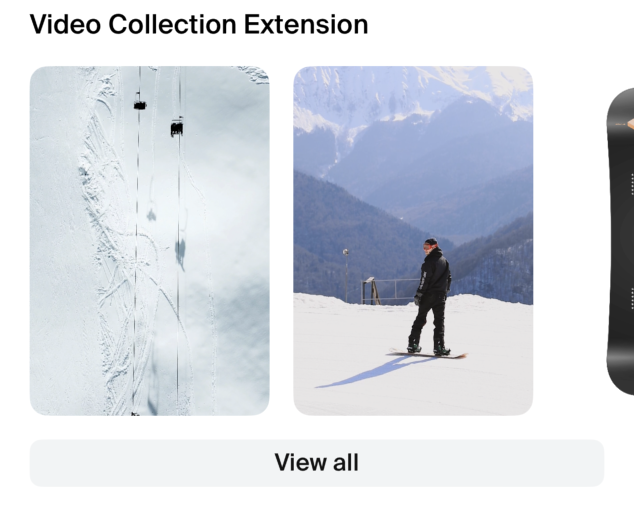
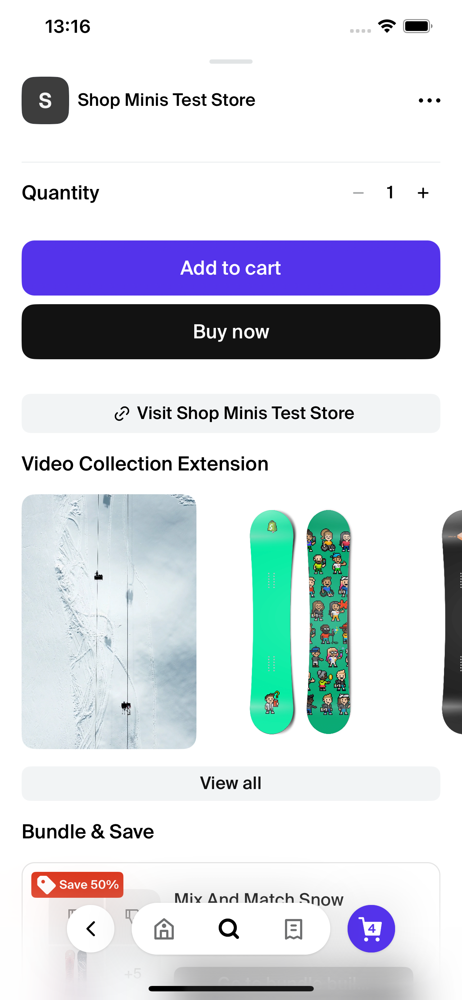

# VideoCollection

The `VideoCollection` component is designed to display a horizontal collection of videos within a React Native application, utilizing the Shop Minis Platform SDK. It is typically used to showcase videos related to products or other content. The component supports interactive elements, allowing users to view details about the products associated with each video.

|  |
|:------------------------------------------------------------------------------:|
| *VideoCollection Example*                                                   |

### Example
```jsx
import { VideoCollection } from '@shopify/shop-minis-ui-extensions'

...

<VideoCollection
  items={[
    {
      video: { uri: "https://example.com/video.mp4" },
      fallbackImage: { uri: "https://example.com/fallback.jpg" },
      relatedProducts: [{ product: { id: '321', name: 'Awesome Product' }, productVariantId: '54321' }],
      externalId: "002"
    }
  ]}
  title="Video Collection Extension"
/>
```

### Props
The component accepts the following props structured as `VideoCollectionData`:

- **title** (`string`, optional): The title of the video collection. Defaults to 'Videos' if not provided.
- **items** (`VideoCollectionItemType[]`): An array of items where each item contains a video, related products, and other metadata.
  - **video** (`Video`): The main video to display.
  - **previewVideo** (`Video`, optional): A preview or alternative version of the video.
  - **fallbackImage** (`Image`): An image to display if the video cannot be loaded.
  - **relatedProducts** (`Array<{product?: Product, productVariantId?: string}>`): Products related to the video.
  - **externalId** (`string`): A unique identifier for external systems.

|  |
|:---------------------------------------------------------------------------------------:|
| *VideoCollection in ProductPage*                                                       |
